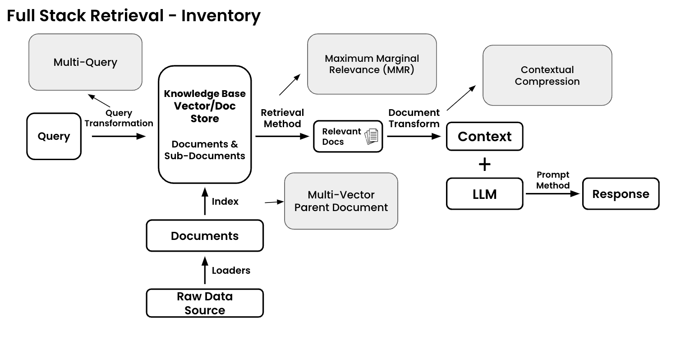

# LLM
1. Definition
- LLM (Large Language Model) is a deep learning model that has been pre-trained on massive text datasets. The core of LLM is the Transformer architecture, consisting of encoder and decoder with self-attention mechanism (allowing transformer to consider different levels of importance between tokens when making predictions). RNN (Recurrent Neural Network) was the initial foundation for sequence data processing. Transformer improved upon RNN through the attention mechanism (introduced in Google's "Attention Is All You Need" paper in 2017), enabling more efficient processing. Modern LLMs are all based on Transformer architecture and no longer use RNN (evolution: RNN → Transformer → LLM (large scale)).

1. Origin
- The fundamental tasks of LLM include Next Word Prediction, Text Generation, Text Completion, and Machine Translation. After being trained on large datasets, LLMs can perform Question Answering, Text Summarization, Reasoning, Code Generation, etc. The first organization to release a transformer model version was OpenAI with GPT-1 (Generative Pre-trained Transformer - 1), and with the advancement of specialized hardware like GPUs, the training and inference process of LLMs has been accelerated.

1. Types of LLMs:
- Pre-training models
- Fine-tuning models (Using a pre-trained model and adjusting it for a specific task - Example: Fine-tuning BERT for text classification, question answering)
- Multimodal models (capable of processing different types of data simultaneously - Example: GPT-4V can process both text and images)

# RAG
- Definition: A technique that retrieves relevant information from knowledge bases to enhance LLM-generated responses
- Motivation: Addresses hallucination issues commonly found in models like LLama-2 and ChatGPT
- Core concept: Retrieves document chunks based on query similarity using dense vector representations

## 1. Components and Architecture

### 1.1 Key Components
- Embeddings Model
  - Converts text into multi-dimensional vectors
  - Processes both documents and queries
- Vector Database (e.g., Pinecone)
  - Stores vector embeddings
  - Enables similarity search

### 1.2 Processing Pipeline
#### Document Processing
- Chunks larger documents into smaller segments
- Converts chunks to vector embeddings
- Stores vectors with metadata in database

#### Query Processing
- Converts user query to vector using same embeddings model
- Performs similarity search in vector database
- Retrieves most relevant document chunks

### 1.3 Context Window Management
- Query allocation: 10-20% of context window
- Retrieved chunks: 40-60% of context window
- Prompt template: 20-30% of context window
- Total length constraint (e.g., 4096 tokens for GPT-3.5)

### *Example:*
"Document: ""Hà Nội là thủ đô của Việt Nam. Thành phố có lịch sử nghìn năm văn hiến.""
-> Embeddings Model created vector: [0.2, 0.5, -0.3, ...]
-> Vector Database stored this vector

#### Query: ""Hà Nội có gì đặc biệt?""
-> Vectorize query: [0.1, 0.4, -0.2, ...]
-> Search in Vector Database
-> Retrieved context + Query + Prompt template 
-> Length check < Context window limit
-> input into LLM to generate the response

#### Retrieval process:
- Query: ""Lịch sử Hà Nội""
retrieved_chunks = [
    {
        ""text"": ""Năm 1010, Lý Thái Tổ dời đô từ Hoa Lư về Thăng Long."",
        ""similarity_score"": 0.89
    },
    {
        ""text"": ""Hà Nội là thủ đô của Việt Nam. Thành phố có lịch sử nghìn năm văn hiến."",
        ""similarity_score"": 0.85
    },
    ...
]
## 2. Retrieval
- Retrieval Basics = Manual retrieval: Data + LLM = Response
- Retrieval Components: Question, Raw Data Source, Knowledge Base, Relevant Docs
### Retrieval Nuts & Bolts

- Document Loaders: Tools that import documents from various sources (PDFs, web pages, databases) into your RAG system. They handle different file formats and structures.
  - Implementation: Abstract interfaces for different data sources
  - Key methods: load(), stream()
  - Handles: Authentication, rate limiting, pagination
  - Common patterns: Factory pattern for different source types
- Index: A specialized data structure that enables fast document retrieval. Common types include vector indexes (for semantic search) and inverted indexes (for keyword search).
  - Data structure optimized for similarity search
  - Common implementations: FAISS, Elasticsearch, Pinecone
  - Trade-offs: Memory vs. speed vs. accuracy
  - Technical considerations: Dimensionality, clustering, quantization
- Knowledge Base: The organized collection of all your documents and their associated metadata, typically stored in a database or vector store.
  - Storage layer integrating documents + metadata
  - Schema design: Document versioning, timestamps, access controls
  - Typically uses: Vector DB + metadata store
  - Considerations: Sharding, replication, consistency
- Relevant Docs: Documents retrieved from your knowledge base that match the current query, usually based on semantic similarity or keyword matching.
  - Retrieved via: kNN search, filtering, reranking
  - Performance metrics: Recall@K, Mean Reciprocal Rank
  - Query optimization: Caching, batching, pruning
  - Implementation: Often uses hybrid search (semantic + keyword)
- Context: The selected portions of relevant documents that are fed into the language model alongside the user's query to generate an informed response.
  - Memory constraints: Token window limits
  - Optimization: Sliding windows, hierarchical chunking
  - Engineering challenge: Context length vs. relevance trade-off
  - Implementation: Smart truncation, prioritization algorithms
- Document Transform:
  - Pipeline architecture: Modular, composable transformers
  - Common operations: Text cleaning, embedding generation, chunking
  - Performance consideration: Async processing, batch operations
  - Error handling: Document validation, transformation recovery
### Retrieval Inventory

- Input Flow:
  - Raw data is loaded into Documents via Loaders
  - Documents are indexed into a Knowledge Base Vector/Doc Store
  - User Query goes through Query Transformation, potentially becoming Multi-Query

- Retrieval Process:
  - System uses two retrieval methods
    - Maximum Marginal Relevance (MMR) to find relevant documents
    - Multi-Vector Parent Document approach for broader context
  - These methods extract Relevant Docs from the knowledge base

- Processing & Response:
  - Documents undergo Document Transform to create Context
  - Context goes through Contextual Compression
  - LLM combines compressed context with prompt method to generate final Response

- Key components that improve retrieval quality:
  - Multi-Query transformation for broader search coverage
  - MMR for diverse, relevant results
  - Contextual compression to optimize context for LLM
  - Vector/Doc store architecture for efficient retrieval

#### Query Transformation (Multi-Query)

### 2.1 Dense Retrieval
- Focus on semantic similarity
- Uses cosine similarity for comparison
- Based on vector representations

### 2.2 Sparse Retrieval
- Emphasizes exact lexical matching
- Keyword-based approach

## 3. Advanced Techniques

### 3.1 Hybrid Search
- *Combines two approaches:* keyword/lexical search and semantic search
+ Keyword/lexical search: Based on exact matching of query terms with content + use techniques like BM25, TF-IDF for relevance scoring
+ Semantic search: 
- *Pipeline:* 
  + Text processing
    - Tokenization: Breaking text into smaller units
    - Cleaning: Removing special characters, handling whitespace
    - Normalization: Converting to lowercase, standardizing formats
  + Embedding generation: 
    - Text-to-vector conversion using language models
    - Common models include: BERT and its variants (RoBERTa, DistilBERT), Sentence transformers like SBERT, Domain-specific models for specialized content
  + Vector Storage and Indexing:
    - Vector databases (like Pinecone, Milvus, FAISS)
    - Indexing structures: HNSW (Hierarchical Navigable Small World), IVF (Inverted File Index)
  + Metadata storage for additional filtering
  + Query processing
  + Result Combination: The results are combined through:
    * Selection of top K results from each method
    * Calculation of composite scores using both keyword and semantic relevance
    * Re-ranking based on combined scores
  + Scoring Mechanisms:
    * Keyword scoring: Often uses BM25 or TF-IDF algorithms
    * Semantic scoring: Uses cosine similarity between vectors
    * Combined scoring: Weighted average or more complex fusion methods

Vector dimensionality typically ranges from 384 to 1024

- Improves retrieval accuracy
- Utilizes language models for embedding conversion

### 3.2 Re-ranking
- Employs cross-encoders
- Refines initial search results

### 3.3 Chunking Strategies
- Critical impact on retrieval effectiveness
- Various methods for document segmentation